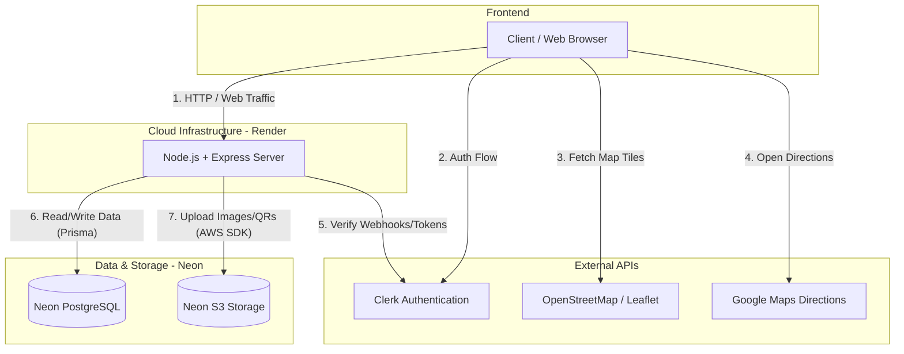

# 🏕️ CampVista


**Live Demo:** [https://camp-vista.onrender.com/](https://camp-vista.onrender.com/)

CampVista is a modern, full-stack campground booking and review platform. It connects outdoor enthusiasts with unique camping spots, allowing users to discover, review, and book campgrounds effortlessly. Campground owners can list their properties, manage bookings, and accept direct payments via QR codes.

---

## 🚀 Features

* **User Authentication:** Secure signup and login powered by Clerk.
* **Role-Based Access Control:** Distinct roles for Customers, Campground Owners, and Admins.
* **Interactive Maps:** View campgrounds on a map, get distances from your current location, and instantly launch Google Maps directions.
* **Booking Engine:** Select check-in/check-out dates, calculate dynamic pricing, and manage booking statuses.
* **QR Code Payments:** Owners can upload their personal UPI/Payment QR codes for customers to scan and pay directly.
* **Reviews & Ratings:** Users can leave authentic reviews and ratings for campgrounds they've visited.
* **Cloud Storage:** High-performance, S3-compatible cloud storage for campground images and QR codes.

---

## 🛠️ Tech Stack

* **Frontend:** HTML, CSS, JavaScript, EJS (Embedded JavaScript templates), Bootstrap 5, Leaflet.js
* **Backend:** Node.js, Express.js
* **Database:** Neon Serverless PostgreSQL
* **ORM:** Prisma
* **Authentication:** Clerk
* **Storage:** Neon Object Storage (S3-Compatible)
* **Hosting:** Render (Web Service)

---

## 🏗️ High-Level Design (HLD)

The architecture follows a modern, stateless backend pattern with managed external services for database, authentication, and file storage.



### Components:
1. **Client Browser:** Renders EJS views, handles user geolocation, and interfaces directly with Clerk for auth states.
2. **Node.js/Express Server (Render):** The core routing logic. It is entirely stateless, relying on external services for persistence.
3. **Clerk:** Manages users, sessions, and passwords securely. 
4. **Neon PostgreSQL:** The primary relational database containing `users`, `campgrounds`, `bookings`, and `reviews`.
5. **Neon S3 Storage:** A robust object storage bucket holding all user-uploaded images and QR codes.

---

## ⚙️ Local Development Setup

To run CampVista locally, follow these steps:

### 1. Clone the repository
```bash
git clone https://github.com/yourusername/CampVista.git
cd CampVista
```

### 2. Install dependencies
```bash
npm install
```

### 3. Configure Environment Variables
Create a `.env` file in the root directory and add your secret keys:
```env
# Database
DATABASE_URL="postgres://[user]:[password]@[neon-host]/neondb"

# Clerk Auth
CLERK_PUBLISHABLE_KEY="pk_test_..."
CLERK_SECRET_KEY="sk_test_..."

# Neon S3 Storage
AWS_ENDPOINT_URL_S3="https://[your-neon-storage-url]"
AWS_ACCESS_KEY_ID="[your-access-key]"
AWS_SECRET_ACCESS_KEY="[your-secret-key]"
AWS_REGION="us-east-2"
```

### 4. Sync Database Schema
Generate the Prisma client and push the schema to your Neon database:
```bash
npx prisma generate
npx prisma db push
```

### 5. Start the Server
```bash
npm run dev
```
Your application will be running at `http://localhost:3000`.

---

## 📄 License
This project is licensed under the MIT License.